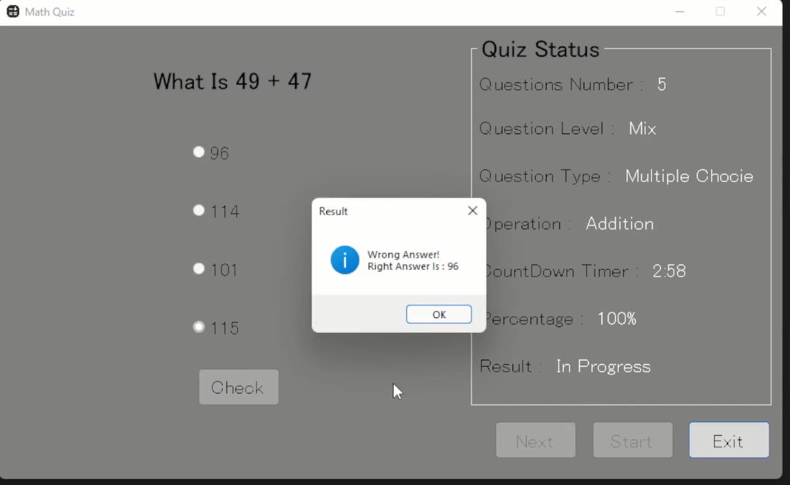

# Math Quiz Game

A simple and fun Math Quiz Game built with C# Windows Forms to test your math skills with a timer and scoring system.

---

## Features
- Multiple choice math questions (addition, subtraction, multiplication)
- Timer for each question to challenge your speed
- Score tracking and final result display
- Clean and simple user interface

## How to Run
1. Clone the repository:
2. Open the solution (`.sln`) file in Visual Studio.
3. Build the project.
4. Run the game and enjoy!

## Screenshots

## Future Improvements
- Add difficulty levels (easy, medium, hard)
- Save and display high scores
- Add sound effects and animations
- Expand to more math operations like division and powers

---

## Contact
For questions or contributions, feel free to open an issue or contact me.

## Author
This project was developed by **El Mostafa Akhiat**.
---
